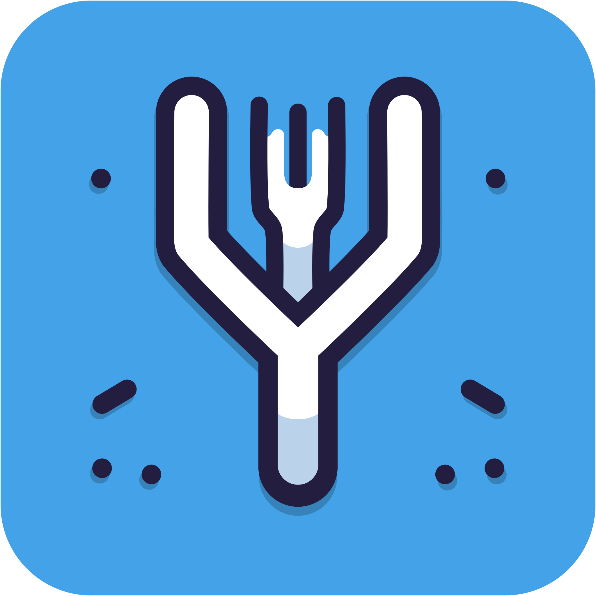

# Fork-Version

[](https://www.npmjs.com/package/fork-version)
[](https://jsr.io/@eglavin/fork-version)
[](https://github.com/eglavin/fork-version/actions/workflows/version.yml)
[](https://github.com/eglavin/fork-version/actions/workflows/release.yml)

<p align="center">
  
</p>

<p align="center">
Fork-Version automates version control tasks such as determining, updating, and committing versions, files, and changelogs, simplifying the versioning process when adhering to the <a href="https://www.conventionalcommits.org">conventional commit</a> standard.
</p>

<details>
<summary>This project is essentially a complete re-write of <a href=https://github.com/conventional-changelog/standard-version>standard-version</a> following on from its deprecation in May 2022.</summary>
Although there are many alternatives such as <a href=https://github.com/googleapis/release-please>release-please</a>. This project aims to continue focusing on just the versioning and changelog generation aspect of the process for use in other Git hosts outside of Github.
</details>

## What Does Fork-Version Do?

By following the [conventional commit](https://www.conventionalcommits.org) standard Fork-Version can automate the following tasks for you:

1. Determine the current and next version
1. Update the version in the selected files [(View the supported files)](./docs/Supported-File-Managers.md)
1. Update your changelog
1. Commit the changed files
1. Create a tag for the new version

Fork-Version won't attempt to push changes to git or to a package manager, this allows you to decide how you publish your changes.

## Using Fork-Version

Primarily designed to be used with `npx`, Fork-Version can also be installed globally or directly to the node package you're working on. The only software prerequisites you need are [git](https://git-scm.com) and [node](https://nodejs.org) or a node compatible runtime.

Fork-Version can be configured either through a config file or by passing options to the tool when ran. To see command line options you can run `fork-version --help` or [view the Configuration documentation](./docs/Configuration.md) for details on the supported options and how to use them.

> [!NOTE]
> Command line options get merged with config file options, any options that are declared through the cli will override options that are also in the config file (Except for the list of [files](./docs/Configuration.md#configfiles) which get merged).

### Using `npx`

To use Fork-Version without installation you can use `npx`:

```sh
npx fork-version
```

`npx` is a package runner which allows you to execute npm packages without installation, this can be useful when working on projects outside of the Node ecosystem.

> [!NOTE]
> By default `npx` [will use a cached version if available on your system](https://github.com/npm/cli/issues/4108#issuecomment-1022827890) or the latest version otherwise. You can use the `latest` tag to force npx to use the latest version. Alternatively if you want to use a specific version or pin to a range you can add a version tag to the end of the package name:
>
> - `npx fork-version@5` (Recommended)
>   - Use the latest version of fork-version in the 5.x range
> - `npx fork-version@5.1`
>   - Use the latest version of fork-version in the 5.1.x range
> - `npx fork-version@5.1.0`
>   - Use the specific version 5.1.0 of fork-version
>
> The version tag needs to match against one of the [published versions on npm](https://www.npmjs.com/package/fork-version?activeTab=versions).

Alternatively you can use other npm compatible javascript runtime's:

| Runner | Command                    |
| ------ | -------------------------- |
| bun    | `bunx fork-version`        |
| deno   | `deno -A npm:fork-version` |

### Install Locally

To install the package locally to your project you can use one of the following commands:

| Package Manager | Install Command                       |
| --------------- | ------------------------------------- |
| npm             | `npm install fork-version --save-dev` |
| pnpm            | `pnpm add fork-version --save-dev`    |
| yarn            | `yarn add fork-version --dev`         |
| bun             | `bun install fork-version --dev`      |

You can then add the following entry to your package.json scripts section and use it like any other script you already use in your project.

```json
// package.json
{
  "scripts": {
    "release": "fork-version -G \"{*/*.csproj,*/package.json}\""
  }
}
```

For example if you use npm you can now use `npm run release` to run Fork-Version.

### Commands

Fork-Version has a number of command modes which will make the program behave differently. The default "command" is the `main` mode, this mode will be used when no other command is defined.

| Command             | Description                                                            |
| ------------------- | ---------------------------------------------------------------------- |
| `main`              | Bumps the version, update files, generate changelog, commits, and tag. |
| `inspect`           | Print the current version and git tag, then exit.                      |
| `inspect-version`   | Print the current version then exit.                                   |
| `inspect-tag`       | Print the current git tag then exit.                                   |
| `validate-config`   | Validates the configuration and exit.                                  |

### Exit Codes

When ran as a cli tool Fork-Version will exit with one of the following exit codes:

| Exit Code | Description                  |
| --------- | ---------------------------- |
| 0         | Success                      |
| 1         | General Error                |
| 2         | Unknown Command              |
| 3         | Config File Validation Error |

### Documentation

Check out the docs folder for more details on configuration options and supported file managers details.

- [Configuration](./docs/Configuration.md)
- [Supported File Managers](./docs/Supported-File-Managers.md)

### Code Usage

> [!WARNING]
> Code usage is not recommended as the public api is not stable and may change between versions.
>
> In the future the api may be stabilized and documented but this is not a focus at this time.
